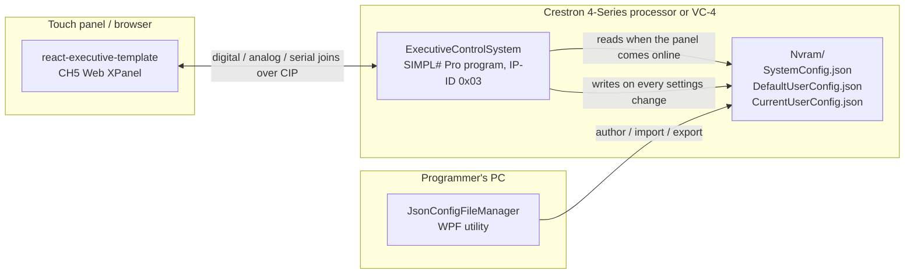

# Crestron CH5 React Executive Template

A starter kit for an executive boardroom control system on Crestron 4-Series processors or VC-4.
It contains three projects that work together:

| Project | What it is | Tech |
|---|---|---|
| [`ExecutiveControlSystem/`](ExecutiveControlSystem/) | The Crestron control program. Owns all room logic and state, talks to the touch panel over CH5 joins, and reads its configuration from JSON files. | SIMPL# Pro, C#, .NET Framework 4.7, Crestron SimplSharp SDK 2.21.237 |
| [`react-executive-template/`](react-executive-template/) | The touch-panel user interface, delivered as a Crestron CH5 Web XPanel. | React 19, TypeScript, Create React App, `@crestron/ch5-crcomlib`, `@crestron/ch5-webxpanel` |
| [`JsonConfigFileManager/`](JsonConfigFileManager/) | A Windows desktop utility for authoring and organising the JSON configuration files the control program loads. Included for reference. | WPF, C#, .NET Framework 3.5, Newtonsoft.Json |

## How the pieces fit together



**Runtime flow**

1. The control program starts, registers an `XpanelForHtml5` device on IP-ID `0x03`, and waits for the panel.
2. When the panel comes online, `RoomController.RefreshAll()` pushes the current state of every control, loads `SystemConfig.json` (room name, source / destination / camera names, help desk info), reads the processor's network settings, and loads the user settings from `CurrentUserConfig.json` (falling back to `DefaultUserConfig.json`).
3. The UI subscribes to feedback joins through CrComLib and renders the live state. Buttons publish digital pulses, sliders publish analog values, and settings publish serial strings.
4. Every settings change coming from the panel is saved straight back to `CurrentUserConfig.json`, so preferences survive a program restart.

The join numbers are the contract between the two sides. They are defined once in
[`ExecutiveControlSystem/JoinMap.cs`](ExecutiveControlSystem/JoinMap.cs) and mirrored by the `Joins` object in
[`react-executive-template/src/hooks/useCrestron.ts`](react-executive-template/src/hooks/useCrestron.ts).
Keep the two files in sync whenever you add or move a join.

## Quick start

1. Build `ExecutiveControlSystem` and load the resulting `.cpz` to a program slot (see [Build and load](#build-and-load)).
2. Edit `ExecutiveControlSystem/Nvram/SystemConfig.json` for your room before building, or edit the copy in the program folder afterwards.
3. Build and deploy the UI with `npm run build:ch5` and `ch5-cli deploy` (see [Deploying the UI](#deploying-the-ui)).
4. Open the Web XPanel. Settings > Diagnostics should show **CH5 Websocket: Connected** and the room name from `SystemConfig.json`.

## ExecutiveControlSystem

### Structure

| File | Responsibility |
|---|---|
| `ControlSystem.cs` | Program entry point. Registers the panel and dispatches every incoming join to `RoomController`. |
| `RoomController.cs` | Room state and the scenario macros: System Startup, System Off, Present to Room, Ingest Mode, BYOD Mode, lighting, master volume, brightness, video source and destination selection. |
| `Video.cs` | Routes the selected source to the selected destination and updates the "routed source" name shown on the panel. |
| `Audio.cs` | Five audio sources (volume up / down / set / default, mute) plus the privacy, wireless-mic and ceiling-mic mutes. |
| `Camera.cs` | Up to ten cameras: select, ten presets per camera, PTZ hold buttons, power, auto-tracking, zoom and movement speed. |
| `SystemInfo.cs` | Date / time clock, `SystemConfig.json` loading, help & support strings, processor network info. |
| `UserConfig.cs` | User preferences persisted to `CurrentUserConfig.json`. |
| `JoinMap.cs` | Every join number, each with a comment giving its direction and meaning. |
| `Nvram/` | The JSON files shipped with the program. |

### Configuration files

| File | Purpose | Shipped in the build? |
|---|---|---|
| `Nvram/SystemConfig.json` | Room definition. The template currently uses `RoomInfo` (name, number), `VideoSources` (name plus `IsRoomPC`, which drives the Ingest Mode far-end list), `VideoDestinations`, `AudioSources`, `Cameras` (with `Presets`) and `HelpSupport`. The remaining sections (DSP, ceiling mics, Lightware, displays, projectors, room video config, ...) are deserialised into `SystemInfo.RoomConfig` and are there for your device integration code. | Yes |
| `Nvram/DefaultUserConfig.json` | Factory defaults for the user settings: theme, brand colour, BYOD behaviour, startup volume, clock format, temperature unit. | Yes |
| `Nvram/CurrentUserConfig.json` | Live user settings written by the program. Created on the first save if it does not exist. The copy in the repo is only used by the React dev server (see [Local development](#local-development)). | No |

At runtime the files are read from `<program directory>/Nvram/` (via `Directory.GetApplicationRootDirectory()`), which is where the build output places them.

### Build and load

Prerequisites: Windows, a Visual Studio version that supports the `.slnx` solution format (recent Visual Studio 2022 or newer), and NuGet access to the `Crestron.SimplSharp.SDK.*` packages. A copy of `nuget.exe` is kept in `.nuget/` for restoring from the command line.

1. Open `ExecutiveControlSystem/ExecutiveControlSystem.slnx`.
2. Restore the NuGet packages listed in `packages.config`, then build. The Crestron SDK targets produce a `.cpz` program archive in the build output folder next to the DLL.
3. Load the `.cpz` to a program slot on a 4-Series processor or a VC-4 room with Crestron Toolbox or the processor's web interface.
4. If your panel uses a different IP-ID, change `PANEL_IPID` in `ControlSystem.cs` and `REACT_APP_XPANEL_IP_ID` in the UI (see below).

> **Note:** some `HintPath` entries in the `.csproj` (`System.Text.Json` and its dependencies) point at a sibling `..\ConstrolSystemTemplate\packages` folder that is not part of this repository. If the build cannot find those assemblies after a restore, reinstall the packages from the NuGet Package Manager so the paths are rewritten, or edit the hint paths to `packages\...`.

### What is simulated

The program keeps full state and feedback for every control, but the device-level I/O is left as `// TODO` so you can plug in your own hardware: camera PTZ, preset and switcher commands in `Camera.cs`, real matrix routing in `Video.cs`, and display power in `RoomController.cs`. The "room PC in meeting" flag (`ROOM_PC_IN_MEETING_FB`) is hard-coded high for testing.

Each module logs to the processor console with a `[Module]` prefix (`[ControlSystem]`, `[RoomController]`, `[Audio]`, ...), which makes the join traffic easy to follow in the Toolbox text console.

## react-executive-template

### Screens

| Screen | Contents |
|---|---|
| Home | Room status pill (Room Ready / In Meeting / BYOD Active), one-touch **Present to Room**, video-conference status, **System On** (single press) or **System Off** (hold for five seconds), a swipe-to-adjust master volume card, and a microphone mute. |
| Video | "Show to far end" sources (only listed while Ingest Mode is on), local sources with signal-present dots, four destination cards with power and video toggles and the routed source name, and a BYOD connect button. |
| Audio | Master volume slider with nudge, default and mute buttons; a large microphone privacy mute; an Advanced section with five per-source rows and the wireless / ceiling mic mutes. |
| Camera | Ten camera-select buttons, ten preset tiles, a PTZ d-pad, zoom, power and auto-tracking. |
| Settings drawer | Theme (dark / light / high contrast) and brand colour; diagnostics (CIP connection state, processor IP, subnet, MAC); BYOD behaviour toggles; panel brightness and startup volume; help & support from `SystemConfig.json`; clock format and temperature unit; a PIN-protected admin area (demo PIN `1234`) with Reset UI. |
| Top bar | Time and date from the processor, page title, Ingest / BYOD badge, room name and number, and an AV Help modal. |

All names shown in the UI (sources, destinations, audio sources, cameras, presets, room name, help desk contact) arrive on serial joins from the processor, so they are edited in `SystemConfig.json`, not in the React code. The strings hard-coded in the components are fallbacks used when no processor is connected.

### Talking to the processor

`src/hooks/useCrestron.ts` is the only file that touches CrComLib directly. It exposes:

- `Joins`: the join-number table, mirrored from `JoinMap.cs`.
- `useDigitalJoin`, `useAnalogJoin`, `useSerialJoin`: subscribe to a feedback join and return its current value.
- `useSendDigitalPulse` (200 ms press then release), `useSendAnalog`, `useSendSerial`: publish to the processor.
- `useWebXPanelConnected`: `true` while the CIP connection to the processor is up.

Hold-style buttons (volume up / down, PTZ) publish `true` on pointer-down and `false` on pointer-up so the processor sees the whole press. `src/index.tsx` initialises the WebXPanel connection with the host, IP-ID and room ID taken from the environment.

### Commands

```bash
cd react-executive-template
npm install
```

| Command | What it does |
|---|---|
| `npm start` | Dev server on http://localhost:3000 with hot reload. |
| `npm test` | Jest and React Testing Library. CrComLib and WebXPanel are mocked in `src/__mocks__/`. |
| `npm run build` | Production build into `build/`. |
| `npm run build:ch5` | Production build, then packs it into `dist/react-executive-template.ch5z` with `ch5-cli archive`. |

### Local development

Create `react-executive-template/.env` (ignored by git):

```
# Processor or VC-4 address. Defaults to the host that served the page.
REACT_APP_XPANEL_HOST=192.168.1.10
# Must match PANEL_IPID in ControlSystem.cs
REACT_APP_XPANEL_IP_ID=0x03
# VC-4 room ID (ignored by hardware processors)
REACT_APP_XPANEL_ROOM_ID=001
```

`src/setupProxy.js` adds two conveniences to the dev server:

- Requests to `/cws` (the WebXPanel token endpoint and WebSocket) are proxied to `https://<REACT_APP_XPANEL_HOST>`, accepting self-signed certificates, so the browser sees a same-origin connection.
- `GET` and `POST /api/user-config` read and write `../ExecutiveControlSystem/Nvram/CurrentUserConfig.json`, so settings changed in the drawer survive a page refresh even with no processor attached. This route exists only in development; on a panel the processor owns persistence.

Without a reachable processor no CIP connection is established: joins never update, Diagnostics shows **Disconnected**, and the UI shows its fallback names. That is expected.

### Deploying the UI

```bash
npm run build:ch5
npx ch5-cli deploy -p -H <processor-ip> -t web dist/react-executive-template.ch5z
```

`-t web` installs the archive as the processor's Web XPanel project (4-Series or VC-4) and `-p` prompts for the device credentials. Then open the processor's Web XPanel URL in a browser.

The UI expects the control program on IP-ID `0x03` (`REACT_APP_XPANEL_IP_ID` at build time). Because the program registers an `XpanelForHtml5` device, the UI targets browsers, Web XPanel and the Crestron XPanel apps. To run it on a physical TSW touch screen, deploy with `-t touchscreen` and register the matching touch-screen class (for example `Tsw1070`) in `ControlSystem.cs` instead.

### Contract file

`contract/ExecutiveContract.cse2j` describes the same signals as named contract components (`SystemControl`, `VideoSource1`, `Settings`, ...) for teams that prefer Crestron's contract-based CH5 workflow, and `src/ContractSignals.ts` exposes those names as typed constants. The shipped app uses numeric joins directly and the archive script does not bundle the contract (`ch5-cli archive` accepts one with `-c`). Treat it as reference material and keep it aligned with `JoinMap.cs` if you adopt it.

## JsonConfigFileManager

`ConfigFileManager` is a small WPF tool (originally from 2016, upgraded and added to this repository in April 2026 for reference) for keeping the JSON configuration of many processors organised. A project file (`.json`) holds three lists, shown as tabs:

| Tab | What you manage |
|---|---|
| Config Templates | Named JSON documents, for example an imported `SystemConfig.json`. Import from disk, export to disk, or press **Modify** to open the template in your default `.json` editor; the tool watches the temporary file and offers to import the changes back. |
| Processor Templates | Reusable connection defaults: port, username, password, config path on the processor and a reboot-after flag. |
| Processors | The individual processors, each with a host name and optional processor and config templates. **Discover** listens for Crestron auto-discovery replies (UDP broadcast on port 41794) and adds the devices it finds with one click. |

What it does not do yet: there is no transport for pushing files to a processor (the project's own README lists SSH.NET, but the source contains no SSH or FTP code), the per-processor `ConfigChanges` override object is stored but never merged into a template, and the JSON tree editor in `View/JsonTree.xaml` is view-only and currently unused. The `Backup/` folder and `UpgradeLog.htm` are leftovers from the Visual Studio project upgrade.

Build: open `JsonConfigFileManager/ConfigFileManager.sln` in Visual Studio with the .NET Framework 3.5 targeting pack installed and restore `Newtonsoft.Json`. The project also references the legacy `WPFToolkit` assembly (3.5.40128.1) without a hint path, so install it or add a reference to a local copy (the `WPFToolkit` NuGet package works).

## Join map at a glance

`JoinMap.cs` is the source of truth. This is the layout it uses today.

**Digital**

| Joins | Function |
|---|---|
| 1 to 4 | Lights on, lights off, lights-on feedback, lights toggle |
| 5, 8 to 10 | System-on feedback, System Startup, System Off, Present to Room |
| 11 to 20 | Video source select 1 to 5, source active feedback 1 to 5 |
| 21 to 28 | Destination power buttons 1 to 4, power feedback 1 to 4 |
| 31 to 38 | Destination video buttons 1 to 4, video feedback 1 to 4 |
| 41 to 45 | Ingest Mode button and feedback, BYOD Mode button and feedback, BYOD select |
| 46 to 53 | Destination select 1 to 4, destination active feedback 1 to 4 |
| 54 to 58 | Source signal-present feedback 1 to 5 |
| 59 to 83 | Audio sources 1 to 5: volume up, volume down, default, mute button, mute feedback |
| 84 to 89 | Privacy, wireless mic and ceiling mic mute buttons and feedback |
| 90 to 129 | Camera: PTZ holds, power, tracking, presets 1 to 10, select 1 to 10, power and tracking feedback, active feedback 1 to 10 |
| 130 to 132 | Master volume default, mute button, mute feedback |
| 133 to 137 | Settings reset, BYOD auto-switch button and feedback, BYOD auto-power button and feedback |
| 138 to 143 | Far-end visibility feedback for sources 1 to 5 (Ingest Mode), room-PC-in-meeting feedback |

**Analog**

| Joins | Function |
|---|---|
| 1 to 4 | Master volume set and feedback, brightness set and feedback |
| 5 to 14 | Audio source volume set 1 to 5, volume feedback 1 to 5 |
| 15 to 18 | Camera zoom speed set and feedback, movement speed set and feedback |
| 19 to 20 | Startup volume set and feedback |

**Serial**

| Joins | Function |
|---|---|
| 1 to 6 | Legacy source name, date, time, label, room name, room number |
| 11 to 15 | Video source names |
| 21 to 28 | Destination names, routed source names |
| 29 to 33 | Audio source names |
| 34 to 43 | Camera names |
| 44 to 53 | Preset names for the selected camera |
| 54 to 56 | IT helpdesk phone, support email, QR label |
| 57 to 60 | Theme mode, brand colour, clock format, temperature unit (bidirectional) |
| 61 to 64 | Processor IP, subnet mask, MAC address, control system IP |

Analog values use the full Crestron range (0 to 65535); the UI converts them to percent for display.

## Adding a new control

1. Add the join constant to `JoinMap.cs` and to `Joins` in `useCrestron.ts`.
2. Handle the incoming join in `ControlSystem.cs` (`HandleDigitalJoin`, `HandleAnalogJoin` or `HandleSerialJoin`) and implement the behaviour in the relevant module.
3. Push the feedback from that module's `RefreshAll()` so a reconnecting panel receives the current state.
4. Use the hooks in a component. Add a test if the control is visible on first render (see `src/App.test.tsx`).
5. If you use the contract workflow, add the signal to `ExecutiveContract.cse2j` and `ContractSignals.ts` as well.

## Known gaps

- Device I/O is stubbed (see [What is simulated](#what-is-simulated)).
- `ROOM_PC_IN_MEETING_FB` is hard-coded high; wire it to your conferencing device.
- The admin PIN lives in client code, the **Reboot Touch Panel** action is a placeholder, and the hardware status rows in Diagnostics are static.
- The AV Help modal in the top bar has hard-coded contact details, while the Settings drawer shows the values from `SystemConfig.json`.
- `ExecutiveContract.cse2j` still names the conferencing mode `Teams_Mode`; `ContractSignals.ts` and the program call it `Ingest_Mode`.
- The control program and the UI handle four video destinations; the contract defines nine destination components.
- `REACT_APP_XPANEL_HOST` is read by both the WebXPanel initialiser and the dev proxy. When it is set, the browser connects to the processor directly and the `/cws` proxy is not used.
